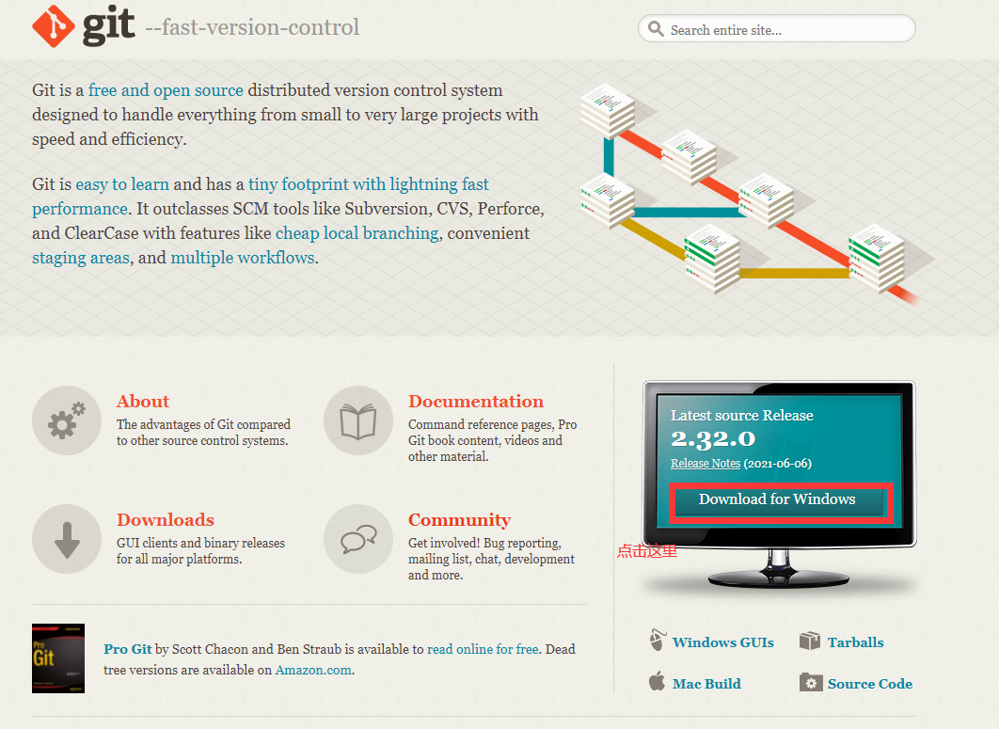
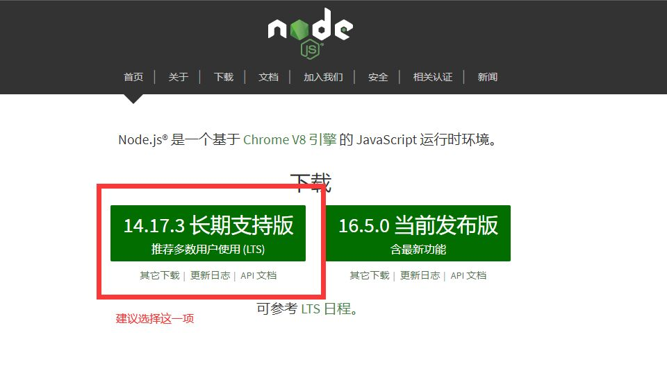

# 关于搭建Hexo博客的初级教程

> 主要是给不太熟练的自己未来某一天崩了重新做blog的教程（当然也会尽量让小白看懂）

这里是通过使用**GitHub**托管搭建的**Hexo**博客。如果你想要自己的域名比如：`www.XXXXX.com`什么的需要前往阿里云或者腾讯云注册，当然，你有**其他渠道**也可以注册。这里仅以**阿里云**为例。或者，你暂时只是想玩一玩，那么可以利用GitHub提供的github.io网站。

---

**注意**：本篇幅使用的是next主题，想要看优化什么的可以关掉了（还有这是window的安装教程，不是mac）

---

## 首先是准备工作

Git 和 node.js

## 下载Git  

[Git](https://git-scm.com/) 



首先进入Git官网下载符合你系统的版本。

下载完成后直接点击安装，想要更改安装位置就更改位置，由于都是干这行的，这里不多赘述。剩下默认安装就可以了。

## 下载Node.js

[下载｜ Node.js](https://nodejs.org/zh-cn/)



建议下载长期支持版本。

同样，除了你想要更改的安装位置，其他默认即可。

然后，我们敲击键盘上的`win + R`键并输入cmd打开终端。(这里特指`win mac`太穷买不起)

在终端输入`npm -v` 回车,显示 版本号,否则就是安装失败,重头再来.(我没失败过,所以这里没有失败经验)

又输入`node -v`,同上.

如果两者都显示出版本号,则安装成功,我们进入下一步.

## 注册你的Github账号

> emmmm,应该都有GitHub账号吧,有的直接跳过进入下一步好了.(这里还是不写了,一般来说到大学了英文水平不至于这么差吧,再不然就用翻译工具吧.再不然互联网搜索注册方法....)

登录 GitHub。

点击右上角的 `+` -> `New repository` 新建仓库。

仓库名称务必为 `你的用户名.github.io`，用户名是英文，大小写无所谓，但建议统一小写。

点击 `Create repository`。

## 安装Hexo

在终端中输入以下命令：

```sh
npm install hexo-cli -g
```

此时，请先通过 `cd` 进入你本地电脑打算存储网站代码的文件夹目录。（或者右键文件夹 Git Bash Here）,当然也可以手动进入,再文件夹里面右键Git Bush就好了.

接下来输入：

```sh
hexo init 你的名字.github.io  #初始化
```

```sh
# 进入你的博客文件夹
cd 你的名字.github.io
# 默认安装所有 `package.json` 文件中提到的包
npm install
# 你也可以缩写成 hexo s
hexo server
```

`server` 代表开启本地的 Hexo 服务器，这时你就可以打开浏览器，在地址栏中输入 `localhost:4000` 就可以看到本地的网页了。

按 `Ctrl + C` 中断服务器的运行。

至此，基础的模版页面便已经搭建好了。

## 使用 Hexo 主题

Hexo 默认提供的是 [hexo-theme-landscape](https://github.com/hexojs/hexo-theme-landscape) 主题。
默认主题样式简单，功能较少。所以大多数人并不会使用默认主题.

## 下载 Hexo 主题

在你储存博客的文件夹中右键Git bush,输入以下命令。

```sh
git clone 你想要的主题地址
```

## 编辑 Hexo 配置

在你此前通过 Hexo 初始化生成的文件目录下，会存在一个 `_config.yml` 文件。

它是 Hexo 的配置文件，关于各配置选项的意义你可以查看 [配置 | Hexo](https://hexo.io/zh-cn/docs/configuration)。

在 `_config.yml` 中找到 `theme` 这个字段，将其后的 `landscape` 修改为 `yun`。

```yaml
theme: 你下载的主题名字,可以在theme文件夹中看到
```

这时再像此前那般使用 `hexo server` 重新启动服务器，你就可以看到一个不一样的主题风格的页面了。

至此,博客搭建初步完成.更多细节请自行百度或者等待我的下一次更新(咕咕.....).
